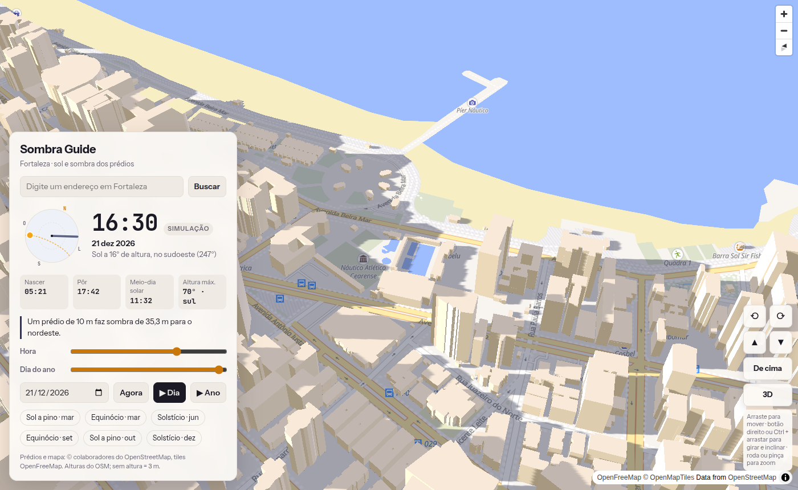

# Sombra Guide · Fortaleza

[](https://github.com/Jaimedsf/sombra-guide/actions/workflows/deploy.yml)
[](https://scorecard.dev/viewer/?uri=github.com/Jaimedsf/sombra-guide)
[](LICENSE)
[](https://www.bestpractices.dev/projects/14998)

Mapa 3D interativo de Fortaleza (CE) que mostra **onde está o sol** e **a sombra que cada prédio faz**, agora ou em qualquer data e hora do ano.

**Acesse:** https://jaimedsf.github.io/sombra-guide/

> **English:** Sombra Guide is an interactive 3D map of Fortaleza, Brazil. It shows where the sun is and the shadow every building casts, for now or for any date and time. It uses OpenStreetMap buildings, MapLibre GL, a three.js shadow layer and SunCalc. The UI is in Portuguese. Code, comments and commits are in English, and issues and pull requests are welcome in either language. See [CONTRIBUTING.md](CONTRIBUTING.md) and [SECURITY.md](SECURITY.md).



## Para que serve

- Descobrir se a varanda, a piscina ou a calçada vai ter sol ou sombra em certo horário
- Ver como a sombra de um prédio muda entre junho (sol ao norte) e dezembro (sol ao sul)
- Planejar fotos, eventos ao ar livre, placas solares ou a escolha de um apartamento

Fortaleza fica a 3,7° ao sul do Equador. O sol passa quase a pino o ano todo e fica **exatamente a pino por volta de 11 de março e 2 de outubro**. De abril a setembro ele fica ao norte ao meio-dia, e as sombras apontam para o sul. De outubro a março é o contrário.

## Recursos

- Prédios 3D da cidade inteira, com as alturas do OpenStreetMap (cerca de 773 mil prédios, 97% com altura)
- Sombras reais projetadas no chão, nas fachadas e nos telhados, inclusive a de uma torre sobre os vizinhos
- Horário atual de Fortaleza ao abrir, com controles de hora e de dia do ano e animações de um dia ou de um ano
- Atalhos para solstícios, equinócios e os dias de sol a pino
- Busca de endereço com número e sugestões enquanto você digita, com indicação de precisão: número exato, número aproximado ou só a rua
- Bússola do céu com a posição do sol, o caminho dele no dia e a direção da sombra
- Nascer e pôr do sol, meio-dia solar e altura máxima do sol no dia
- Comprimento da sombra de um prédio de 10 m na hora escolhida
- Link compartilhável: a câmera e o momento ficam na URL

## Como usar

| Ação | Mouse | Toque / touchpad |
| --- | --- | --- |
| Mover | arrastar | arrastar com um dedo |
| Girar e inclinar | botão direito + arrastar, ou Ctrl + arrastar | dois dedos |
| Zoom | roda do mouse | pinça |

Os botões ⟲ ⟳ ▲ ▼, "De cima" e "3D" no canto inferior direito fazem o mesmo.

### Parâmetros de URL

| Parâmetro | Exemplo | Efeito |
| --- | --- | --- |
| `?data=AAAA-MM-DD` | `?data=2026-12-21` | abre numa data fixa |
| `&hora=HH:MM` | `&hora=16:30` | abre num horário fixo (horário de Fortaleza) |
| `#zoom/lat/lng/rumo/inclinação` | `#17/-3.7262/-38.4965/-25/60` | posição da câmera |

Exemplo: `https://jaimedsf.github.io/sombra-guide/?data=2026-06-21&hora=08:00#16.8/-3.7262/-38.494/-25/45`

A URL se atualiza sozinha: ao escolher data e hora, elas entram em `?data=&hora=`, e o botão "Agora" tira as duas. Valores inválidos na URL são ignorados.

## Como funciona

```
OpenFreeMap (tiles vetoriais do OSM) ──► MapLibre GL (mapa base)
                                    └──► camada customizada three.js
                                           ├─ extrusão dos prédios a partir de render_height
                                           ├─ luz direcional = sol (SunCalc: azimute e altura)
                                           └─ mapa de sombra + chão invisível (ShadowMaterial)
```

1. **Mapa base.** O MapLibre GL desenha o estilo *Liberty* do OpenFreeMap. A camada plana de prédios fica no estilo, só que invisível. Sem ela, o MapLibre descartaria os dados de prédio dos tiles novos.
2. **Prédios 3D.** O arquivo `src/city3d.js` lê os polígonos de prédio dos tiles carregados e monta uma única malha com paredes e telhados triangulados. Isso cobre um raio de 1,2 km do centro da tela, em coordenadas locais em metros. A malha é refeita quando o mapa se afasta dessa área ou chegam tiles novos.
3. **Sol.** O SunCalc calcula o azimute e a altura do sol no centro do mapa. Esses valores posicionam uma `DirectionalLight` do three.js. A câmera de sombra acompanha o centro da tela.
4. **Sombras.** Um mapa de sombra de 4096² sobre 2,4 km dá cerca de 0,6 m por texel. Um plano com `ShadowMaterial` mostra só a sombra sobre o mapa base.
5. **Busca.** O Esri é consultado primeiro. No OSM de Fortaleza quase nenhuma casa tem número cadastrado, então o Nominatim só entra se o Esri falhar ou não achar nada. Enquanto você digita, só as sugestões do Esri são consultadas: a política de uso do Nominatim proíbe autocompletar. Uma busca nova cancela a anterior, então uma resposta atrasada nunca substitui a lista mais recente.
6. **Horário.** Tudo fica no horário de Fortaleza (UTC−3, sem horário de verão), em qualquer fuso em que o navegador esteja.

## Rodar localmente

Requer Node.js 20.19+ ou 22.12+ (mínimo do Vite 8).

```sh
npm install
npm run dev      # http://localhost:5173
npm test         # checagem rápida + testes de propriedade (fast-check)
npm run build    # site estático em dist/
npm run preview  # serve o dist/ localmente
```

Não abra o `index.html` direto no navegador. O projeto usa o Vite para resolver os módulos.

## Estrutura

```
index.html          interface (painel, busca, controles de câmera)
src/main.js         mapa, estado de data e hora, painel, busca, animações
src/city3d.js       camada three.js: prédios, luz solar e sombras
src/time.js         conversões para o horário de Fortaleza e dia do ano
src/play.js         animações de um dia e de um ano
src/search.js       busca de endereço (Esri e Nominatim)
src/url.js          data e hora na URL (?data=&hora=)
src/extra-buildings.json  prédios que ainda não estão no OSM (GeoJSON com render_height)
src/style.css       estilos
check.mjs           checagem rápida de fuso e posição do sol
test/               testes de propriedade com fast-check (npm test)
.github/workflows/  deploy automático no GitHub Pages
```

## Hospedagem

O site é estático e está hospedado de graça no **GitHub Pages**. O workflow `.github/workflows/deploy.yml` roda o teste, gera o build e publica a cada push na `main`.

O `dist/` também funciona em outros hosts estáticos gratuitos, como Cloudflare Pages, Netlify ou Vercel. Nesses, o comando de build é `npm run build` e a pasta publicada é `dist`.

## Prédios que faltam no OSM

Prédios novos que ainda não estão no OpenStreetMap podem entrar em `src/extra-buildings.json`. Cada um é um polígono GeoJSON com `render_height` em metros e é desenhado e sombreado como os demais. Hoje o arquivo tem as duas torres do Estilo Passaré (Av. dos Paroaras, 1200), com térreo + 11 andares, cerca de 35 m. O contorno foi traçado sobre a imagem de satélite da Esri.

Quando o prédio for mapeado no OSM, apague a entrada do arquivo. Se ficar, ele é desenhado duas vezes. O melhor caminho é sempre mapear no próprio OSM, porque aí o prédio aparece para todo mundo.

## Limitações

- As alturas vêm do OpenStreetMap. Prédio sem altura aparece com 3 m, e alturas erradas no OSM aparecem erradas aqui.
- A sombra considera só os prédios num raio de 1,2 km do centro da tela e não inclui árvores nem relevo.
- Os prédios são prismas: telhados inclinados e detalhes de fachada não aparecem.
- Mover o mapa pode causar um breve engasgo enquanto a malha é refeita.

## Créditos

- Dados © colaboradores do [OpenStreetMap](https://www.openstreetmap.org/copyright), sob a licença ODbL
- Tiles e estilo: [OpenFreeMap](https://openfreemap.org)
- Busca de endereço: [Esri ArcGIS World Geocoder](https://developers.arcgis.com/rest/geocode/), que conhece os números das casas em Fortaleza. É usado sem chave e sem guardar resultados, como a Esri permite para buscas pontuais. As sugestões ao digitar usam o endpoint `suggest`, feito pela Esri para autocompletar. O [Nominatim](https://nominatim.org) fica de reserva, com uma requisição por busca enviada e nunca ao digitar, conforme a [política de uso](https://operations.osmfoundation.org/policies/nominatim/)
- Bibliotecas: [MapLibre GL JS](https://maplibre.org), [three.js](https://threejs.org), [SunCalc](https://github.com/mourner/suncalc), [Vite](https://vite.dev)

## Segurança e qualidade

- **CodeQL** (`.github/workflows/codeql.yml`): análise estática do JavaScript e dos workflows a cada push, PR e toda semana, com as regras de segurança estendidas e as de qualidade de código
- **Dependabot**: alertas de vulnerabilidade, PRs automáticos de correção e atualização semanal das dependências npm e das GitHub Actions
- **Secret scanning** com bloqueio no push: impede subir chaves e tokens por engano
- **OpenSSF Scorecard**: nota de segurança da cadeia de suprimentos, recalculada toda semana (selo acima)
- **CI**: cada push e PR roda `npm audit`, os testes (`npm test`, com testes de propriedade em fast-check) e o build antes de publicar
- Actions fixadas por SHA e token do Actions somente leitura por padrão
- A `main` não aceita force push nem pode ser apagada
- Cada release traz o site pronto (`sombra-guide-vX.Y.Z.tar.gz`) assinado com Sigstore. Para verificar:
  ```sh
  cosign verify-blob sombra-guide-v1.0.0.tar.gz --bundle sombra-guide-v1.0.0.tar.gz.sigstore \
    --certificate-identity-regexp '^https://github.com/Jaimedsf/sombra-guide/\.github/workflows/release\.yml@' \
    --certificate-oidc-issuer https://token.actions.githubusercontent.com
  ```
- Vulnerabilidades devem ser relatadas em privado, conforme o [SECURITY.md](SECURITY.md)

## Como contribuir

Bugs e sugestões vão nas [issues](https://github.com/Jaimedsf/sombra-guide/issues), e código entra por pull request. O passo a passo e a política de testes estão no [CONTRIBUTING.md](CONTRIBUTING.md). As mudanças de cada versão ficam no [CHANGELOG.md](CHANGELOG.md).

## Licença

[MIT](LICENSE)
